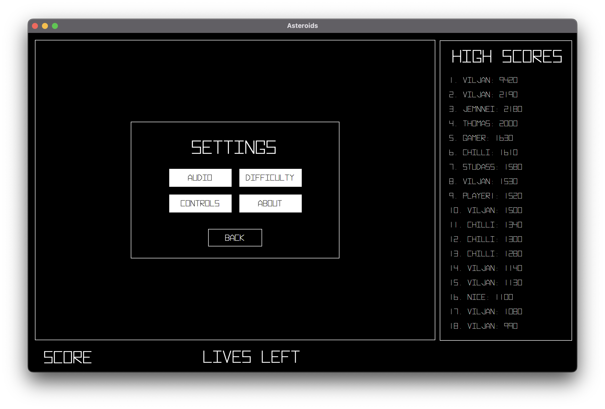
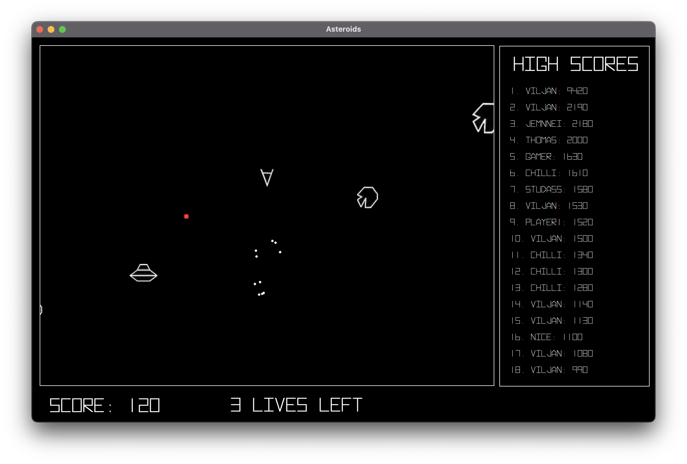

# **Asteroids**

    <figure align="center">
        
    </figure>

**In the game Asteroids you are in controll of a spaceship. You have one objective: shoot asteroids and do not get hit by the asteroids yourself. You can thrust by pressing the up-arrow, steer using left- and right-arrow. Lastly, you shoot by pressing space. Hitting a large asteroid gives you 20 points, and it will split up into 3 new small asteroids, which each gives you 10 points when you destroy them. In addition UFO's can spawn, and they shoot red lasers back at you. Destroying the UFO's wil give you 50 points.**

You start the game by running [AsteroidsApp.java](src/main/java/asteroids/AsteroidsApp.java).

---

## Screenshots

    <figure align="center">
        
        <figcaption><i>New game menu appearing when starting up the game.</i></figcaption>
    </figure>

    <figure align="center">
        
        <figcaption><i>Game over menu where you can save your score with along side a player name.</i></figcaption>
    </figure>

    <figure align="center">
        
        <figcaption><i>The game lets you adjust difficulty and audio from the settings. You can also see the controls and a section about the game. </i></figcaption>
    </figure>

    <figure align="center">
        
        <figcaption><i>When you shoot an asteroid or a spaceship, it will explode into many small pieces.</i></figcaption>
    </figure>

_Made by [Arash](https://github.com/Arashfa0301) and [Viljan](https://github.com/viljanvr)._
