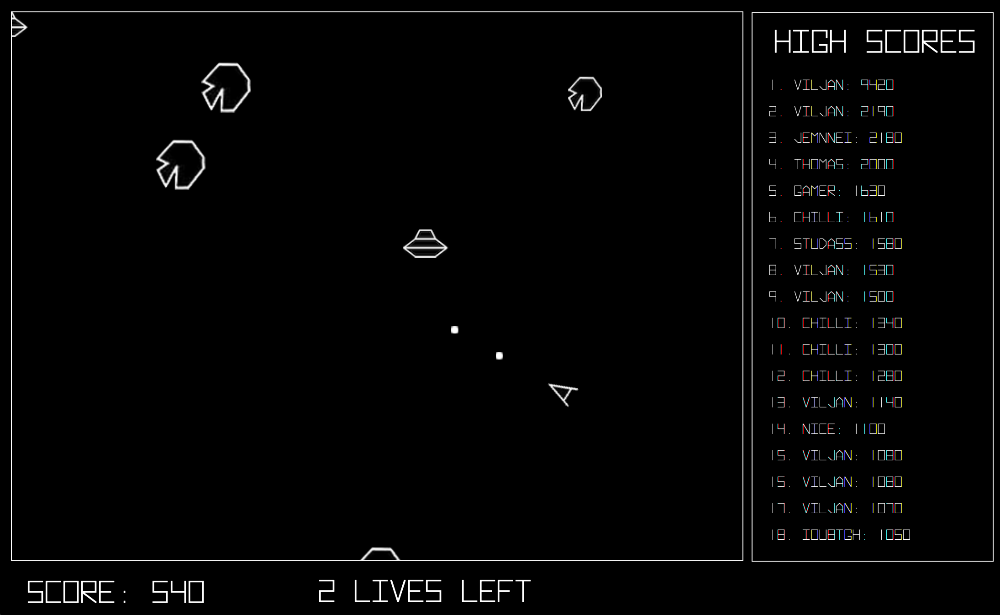
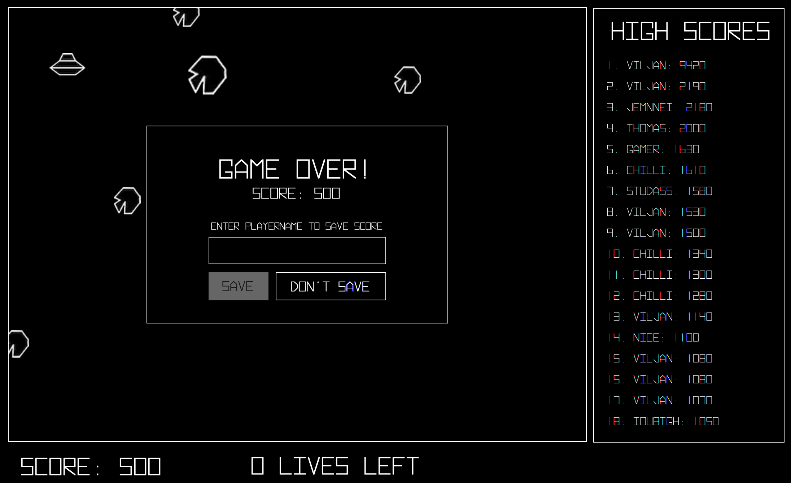
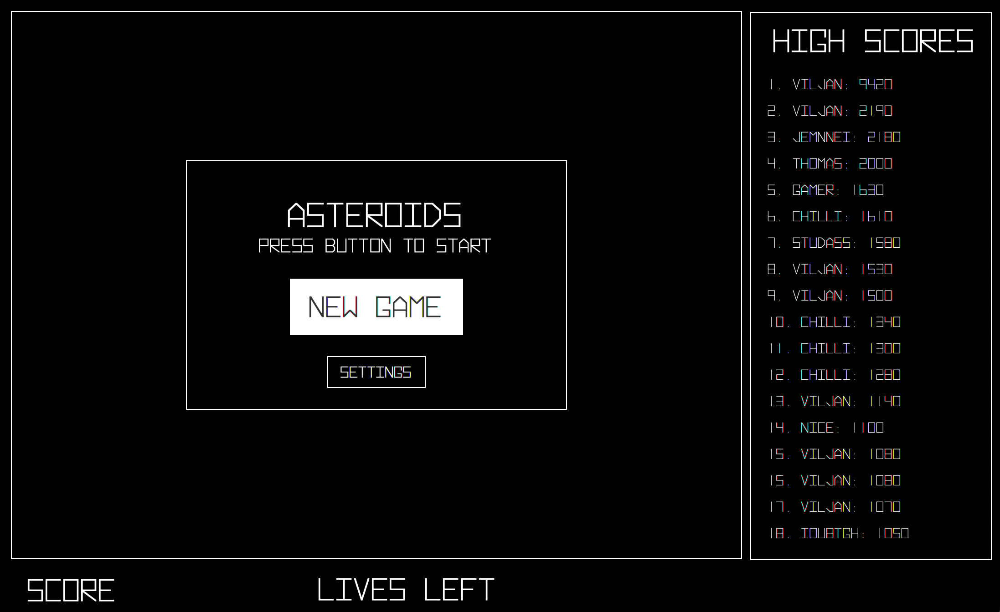

# **Asteroids**

<figure>

</figure>

**This is a recreation of the original arcade game Asteroids, released by Atari in 1979. The objective of the game is to steer a spaceship and to get as many point as possible by shooting incomming asteroids and UFOs. If you crash into an asteroid or UFO or you get shoot by an UFO you'll lose one life. You have a total of tre lives before the game is over. Shooting an asteroid will give you 20 points, and the asteroid will splitt into three new small asteroids, which gives you 10 points each. Shooting the UFO gives you 50 points. When you have lost all your lives you can save your score on a leaderboard along with your name. The leaderboard is always visible on the right side of the screen. If prefeered, you can also choose to not save your score. The controlls in this game are relativly simple: Use arrow-up or w to thrust. Use arrow-left and arrow-right or a and d to steer left and right. Use space to shoot lasers. In addition the game includes settings where you can change the difficulty and adjust the volume.**

The game is built using Java and JavaFX. The game using a modell-view-controller design pattern. The application consists of two controllers, the main one beeing [AsteroidsController.java](src/main/java/asteroids/Controllers/AsteroidsController.java). The [MenuController.java](src/main/java/asteroids/Controllers/MenuController.java) is for the menu overlay appearing before or after a game. The modell consists of a [Game-class](src/main/java/asteroids/Game.java) handling the game logic. The [Spaceship](src/main/java/asteroids/Spaceship.java)-, [Asteroid](src/main/java/asteroids/Asteroid.java)-, [Laser](src/main/java/asteroids/Laser.java)-, [UFO](src/main/java/asteroids/UFO.java)- and [Debris](src/main/java/asteroids/Debris.java)-classes implements the abstract [Sprite-class](src/main/java/asteroids/Sprite.java). In addition there is one [ScoreBoard-class](src/main/java/asteroids/ScoreBoard.java) that saves all score to a text-file and a [Settings-class](src/main/java/asteroids/Settings.java) that saves user settings to a text-file.

**You can launch the game by running [AsteroidsApp.java](src/main/java/asteroids/AsteroidsApp.java).**

---

## Screenshots

<figure>

<figcaption>Game over screen: You have to posibility to either save or discard your score and then start a new game. </figcaption>
</figure>

**_This game is made by Arash and Viljan_**
