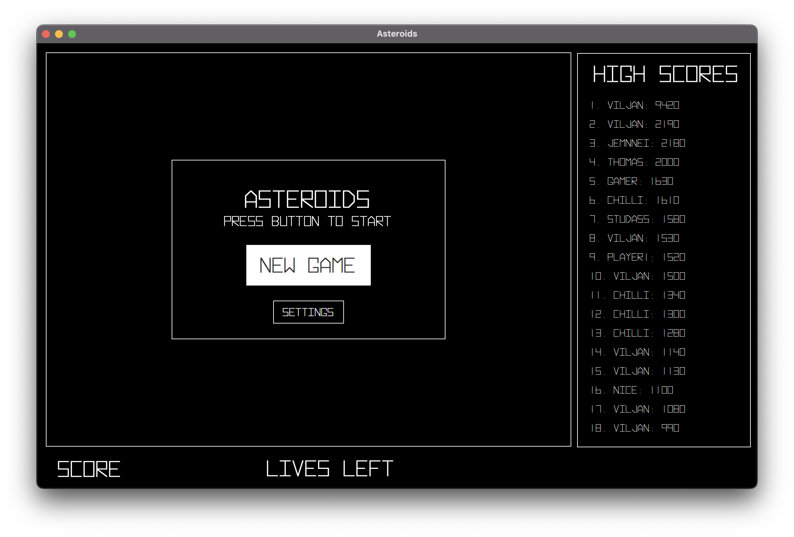

# **Asteroids**

**In the game asteroids you controll a spaceship flying thorugh space. You have one objective: shoot asteroids and not get hit by the asteroids yourself. You can thrust by pressing the up-arrow, steer using left- and right-arrow. Lastly, you shoot by pressing space. Hitting a large asteroid gives you 20 points, and it will split up into 3 new small asteroids, which each gives you 10 points when you destroy them. The game has a built in scoreboard. Every time you time you have the posibility to save your score alongside with a playername.**

**You can launch the game by running [AsteroidsApp](src/main/java/asteroids/AsteroidsApp.java).**

<figure>

</figure>

---

## Screenshots

<figcaption>Game over screen: You have to posibility to either save or discard your score and then start a new game. </figcaption>

**_Made by Arash and Viljan_**
